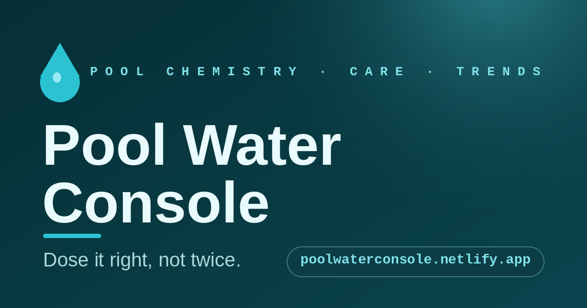

# Pool Water Console

**Dose it right, not twice.** A no-guesswork web console that turns your pool
test readings into the exact amounts of chemical to add — in the right order —
plus seasonal supplies, care routines, trends, and fix-it playbooks.

> Live site: **https://poolwaterconsole.netlify.app/**



Defaults assume a **~10,000 gal vinyl pool**, but every target adapts to your
pool from **Pool setup** on the Dose tab: volume, **surface** (vinyl liner,
fiberglass, or plaster/gunite — it moves the calcium band), how you chlorinate
day-to-day (liquid/granular by hand, **trichlor pucks in a feeder or floater**
with a refill reminder, or a salt cell), chlorine products, and season. The
setup is remembered on your device.

Dosing is **test-tolerance aware**: a reading within one test-step of a band
edge (±0.5 FC, ±0.1 pH, ±10 TA/CYA, ±25 CH) is reported as *"within test
tolerance"* instead of prescribing a micro-dose your strip couldn't verify —
and when a strip bottle's generic "OK" range disagrees with the computed
target, the dose list says so and explains why.

A **care strategy** picker (Balanced / Crystal-clear / Save money / Low effort)
tunes where you aim *inside* the safe band and what gets recommended — the
algae floor and shock level never move. "Save money" computes the cheapest
honest chlorine for your pool and estimates the seasonal savings of switching.

Pro tools, all free and client-side:
- **Water balance (CSI)** — the Langelier/calcite saturation index from your
  readings plus water temp and TDS, with surface-aware advice (etching vs
  scale) and a winterization what-if (set the temp to your coldest water).
- **"What happens if I add…"** — the dose list in reverse: preview any
  amount of any product before you pour it, including side-effects
  (dichlor/trichlor's permanent CYA, cal-hypo's calcium).
- **Dilution math** — high CYA/CH steps state the exact % of water (and
  gallons) to swap, not just "partial drain."
- **Chlorine price check** — enter any shelf price and container size and get
  $ per +1 ppm FC in *your* pool, judged against going rates (with the CYA
  "baggage cost" of stabilized products called out).
- **Volume calculator** — round / oval / rectangle with average depth.
- **Tonight's heat & evaporation** (Care tab) — a physics-based overnight
  model (ASHRAE-style evaporation, radiation to the night sky, wind-scaled
  convection) comparing bubble-cover-on vs off: morning water temp, °F and
  BTU lost, gallons evaporated, and the heater cost to win it back. Tonight's
  low auto-fills from the Plan-tab forecast.

---

## Who it's for

Anyone who tests their own water and would rather add the right dose once than
chase the numbers all week — owners of above-ground or small in-ground pools.
Set your volume, chlorine type, and whether you run a salt cell, and the targets
follow automatically. A first-run **welcome tour** (and the `?` button, top-right)
explains who it's for and how each tab works.

**Easy on the eyes.** The gear button (top-right) opens **Display** settings:
a **Light / Auto / Dark** appearance toggle (Auto follows your device) and a
**text-size** slider (80–170%) for larger, more readable type. Both choices are
remembered on your device, and dark mode applies instantly with no page flash.

## How to use it — the seven tabs

| Tab | What it does |
| --- | --- |
| **Learn** | A goal launcher (fill / test / winterize / …), a tour of every tool, and a plain-English guide to **why** you test and what each number (FC, CYA, TA, pH, CH) means. |
| **Dose** | Enter strip/kit readings (or **Scan strip** from a photo) → exact, ordered add-list. |
| **Buy** | A season shopping list scaled to your pool, with the cheapest time to buy each item. |
| **Care** | Cleaning rhythm, pump runtime, and fill / electricity calculators. |
| **Plan** | This week's outlook (add your ZIP for a live forecast) plus opening, closing, and leak playbooks. |
| **Trends** | Log readings to chart them against the safe band and catch drift early. |
| **Fix-it** | A symptom solver and the stubborn mustard-algae playbook. |

## Your data — local only

No accounts, no analytics, no tracking. All persistence is **`localStorage` in
your browser**: readings, history, maintenance reminders, settings, and your ZIP
are saved **only on your device** — nothing is uploaded to a server. Strip photos
are processed on-device. Export/import (JSON or CSV) on the Trends tab lets you
back up or move your history between devices. **Add to Home Screen** (the install
button) for a full-screen app.

Two optional features make outbound calls **only when you ask**:
- **Plan → Get forecast** geocodes your ZIP ([Zippopotam](https://zippopotam.us/))
  and pulls a 7-day outlook ([Open-Meteo](https://open-meteo.com/)). No account,
  no tracking; the ZIP is stored locally.
- Google Fonts are loaded from a CDN for typography.

Everything else — dosing math, strip color-reading, charts — runs entirely in
the browser with no network.

---

## Architecture

This is a **single self-contained file**: [`index.html`](./index.html). It
inlines all CSS and JavaScript, embeds its own icons and PWA manifest as data
URIs, and ships no build step or dependencies. That makes it trivial to host —
any static file server (or just opening the file locally) works.

```
.
├── index.html      # the entire app (HTML + CSS + JS, ~230 KB)
├── 404.html        # branded not-found page
├── og-image.png    # social share / Open Graph card (1200×630)
├── robots.txt      # crawl directives + sitemap pointer
├── sitemap.xml     # single-URL sitemap
├── netlify.toml    # Netlify deploy, security headers, caching
├── LICENSE         # Apache-2.0
└── README.md
```

## Deploying to Netlify

Netlify serves **`index.html` at the site root** — the HTML is the page.
`netlify.toml` pins down the production config:

- `publish = "."` and an empty `command` — no build, publish the repo root.
- **Security headers** on every route: a scoped Content-Security-Policy,
  HSTS, `X-Frame-Options: DENY` / `frame-ancestors 'none'`,
  `X-Content-Type-Options: nosniff`, `Referrer-Policy`, `Permissions-Policy`,
  and COOP/CORP.
- **Caching:** `index.html` always revalidates so updates ship immediately;
  `og-image.png` is allowed to cache.
- **No catch-all rewrite** — the app has no URL-based routing (tabs are
  client-side), so unknown paths return a real 404 via `404.html`. This keeps
  the indexable site free of soft-404s.

**To deploy:**

1. Connect this repo to Netlify (or drag the folder into the Netlify UI).
2. Build command: *(none)* · Publish directory: `.`
3. Deploy. `localStorage` works on any HTTPS origin, so memory persists per
   browser automatically.

For local preview, just open `index.html` in a browser, or:

```bash
npx serve .       # or: python3 -m http.server 8000
```

> A PWA installs best from a hosted HTTPS URL; opening the raw file is fine for
> testing but the manifest behavior is most reliable on the deployed site.

### Regenerating the share image

`og-image.png` (1200×630) is the social-share card. To regenerate it, edit and
re-run the Pillow script used to create it (see commit history), or replace the
PNG directly — keep it 1200×630 and re-scrape caches afterward with the
[Facebook Sharing Debugger](https://developers.facebook.com/tools/debug/).

---

## The dosing math (assumptions)

All amounts are per your configured volume (default 10,000 gal) using
well-established pool-chemistry constants:

- **Free chlorine target scales with CYA** (the Trouble Free Pool model):
  target ≈ **7.5 %** of CYA, algae floor ≈ **5 %**, shock ≈ **40 %**
  (salt cell: ~6 % target, CYA 60–80).
- **Chlorine:** ~10.5 fl oz of 12.5 % liquid per +1 ppm FC / 10k gal
  (and the equivalent for 10 %/8.25 %/6 % bleach, 65 % cal-hypo, 56 % dichlor).
- **Alkalinity:** 24 oz (1.5 lb) baking soda per +10 ppm / 10k gal.
- **pH:** ~8 fl oz muriatic acid (31.45 %) per −0.2 pH at TA 80, scaled by the
  measured TA (÷80, clamped 0.6–1.5× — more buffer needs more acid); ~6 oz soda
  ash per +0.2 pH / 10k gal.
- **Stabilizer:** 13 oz cyanuric acid per +10 ppm / 10k gal.
- **Calcium:** ~1.84 oz calcium chloride per +1 ppm / 10k gal. Target band
  follows the surface: vinyl 150–250 (optional), fiberglass 220–320,
  plaster/gunite 250–450.
- **Pucks:** a 3″ trichlor tablet (8 oz, 90 %) adds ~5.3 ppm FC and ~3.3 ppm
  permanent CYA per 10k gal; the feeder planner assumes ~2.5 ppm/day summer
  demand.
- **Pump/fill:** turnover = volume ÷ GPM; gal-per-inch = π·r²·(1/12)·7.48 for a
  round pool; pump cost = volts × amps ÷ 1000 × hours × rate.

These are guidance estimates — confirm large or unusual doses against a reliable
drop-test kit before adding. Add chemicals to water (never the reverse), one at a
time, with the pump running. **Not professional, medical, or safety advice.**

### Certifying the math — regression tests

Because a wrong number here means a real person pours the wrong amount into their
pool, the dosing math is **locked by tests**. The formulas live in one DOM-free,
clearly delimited block in `index.html` (between the `DOSE-ENGINE-START` /
`DOSE-ENGINE-END` markers). The suite in [`tests/dosing.test.mjs`](./tests/dosing.test.mjs)
extracts *that exact block* from the shipping file, evaluates it, and asserts
known, hand-checked doses — so an accidental edit that would change any
real-world amount fails before it can ship. The same golden values are
re-checked in the browser on load (a one-line console warning if they ever
drift).

No dependencies, no build step — just Node 18+:

```bash
node --test        # or: npm test
```

If you change a constant on purpose, update the expected value in the test in
the **same commit** — never the other way around.

---

## License

Copyright © 2026 Karl Meves (ERRERLabs). Licensed under the
[Apache License 2.0](./LICENSE).
